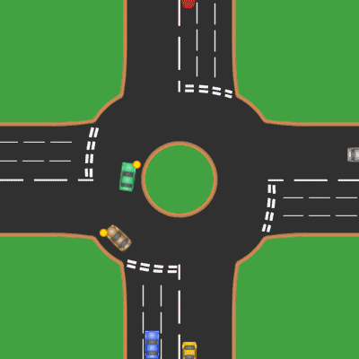

# TC2008B.301 - Proyecto Multiagentes
**Autores**: *Carlos Yair Herrera Rodríguez, Alma Teresa Carpio Revilla, Andrés Cabrera Alvarado, Mariana Marzayani Hernández Jurado*.

## Proposito
Establecer un reto de programación y control de agentes.

Este reto combina conceptos de inteligencia artificial (como la planificación y el control de agentes autónomos), habilidades de programación (para definir las reglas y algoritmos que los robots seguirán), y pensamiento lógico (para organizar el espacio y gestionar los recursos disponibles).

## Ejemplo mapa
Aquí tenemos nuestro diseño en formato 2D del desarrollo del proyecto. 

## Recursos

- ***AssetStoreUnity***
- ***Cgtrader***
- ***turbosquid***
- ***Clara.io***

### Información Legal    
> [!NOTE]
> Derechos de autor © Derechos Reservados a los autores
